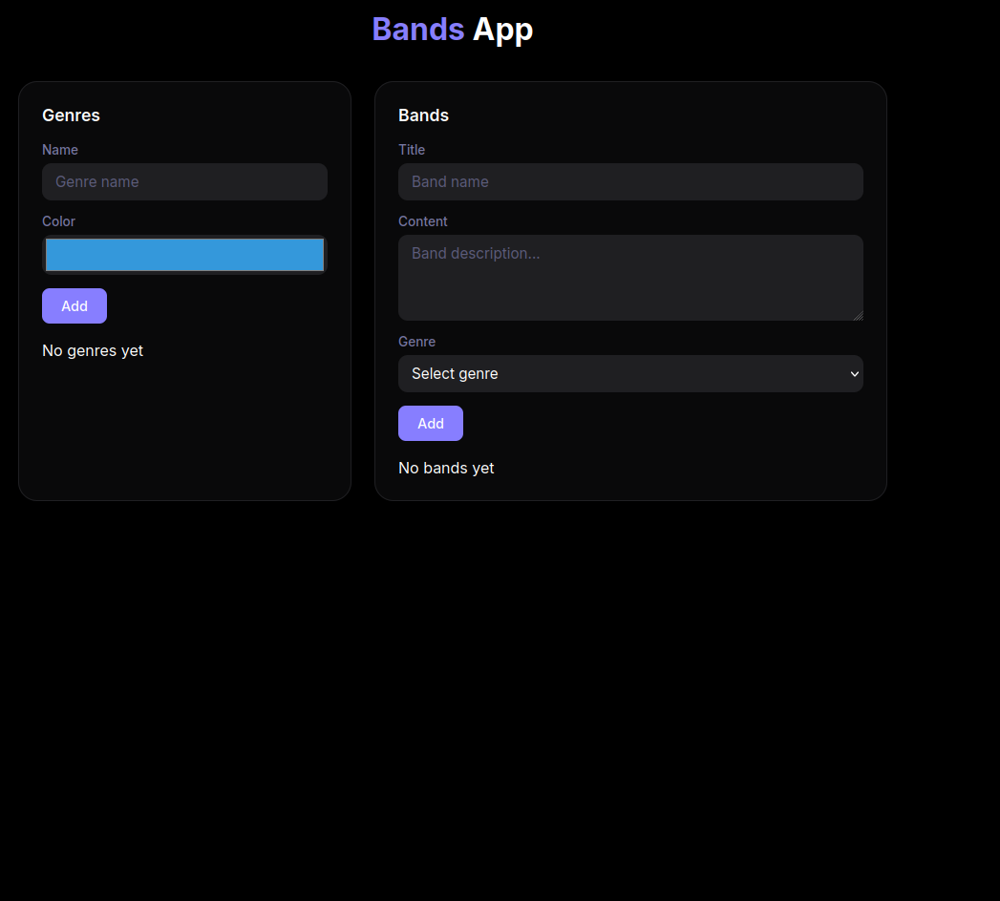
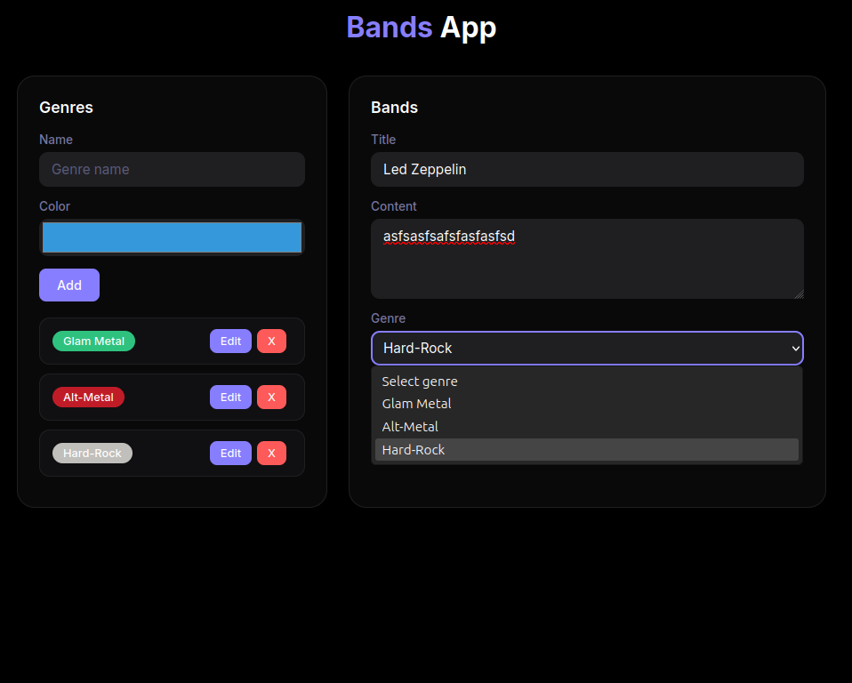
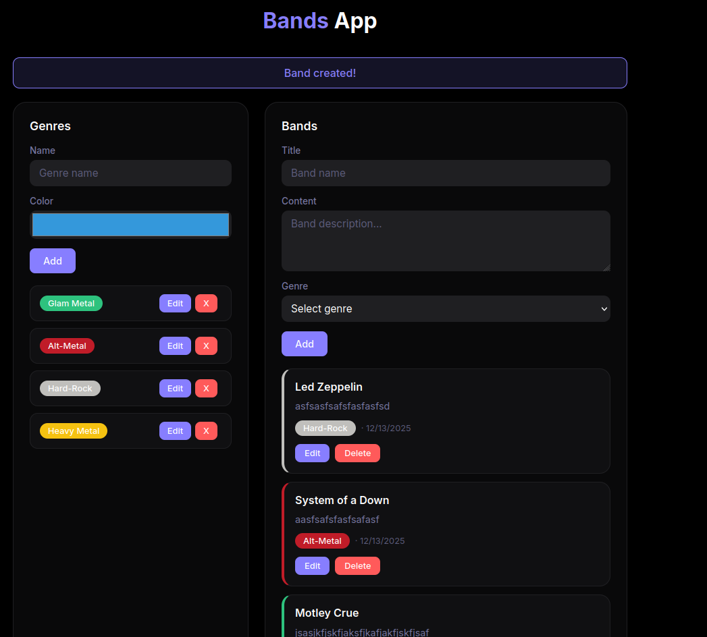
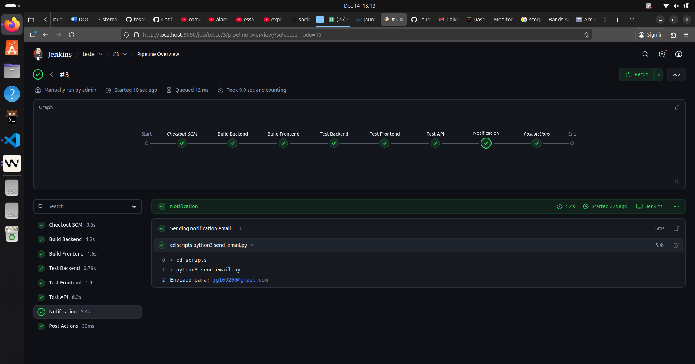
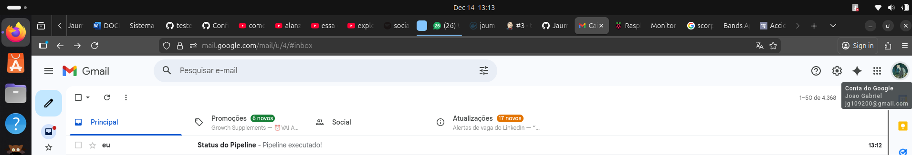

# Bands App

Sistema simples de gerenciamento de bandas organizadas por gênero musical.

## Tema

Aplicação para cadastrar e organizar bandas por gênero musical. Cada gênero pode ter várias bandas (relacionamento 1:N).

## Estrutura

```
├── backend/          # API FastAPI
│   └── app/
│       ├── main.py
│       ├── database.py
│       ├── models.py
│       ├── schemas.py
│       └── routes/
└── frontend/         # React + Vite
    └── src/
```

## Como rodar o Backend

```bash
cd backend

# Criar ambiente virtual
python -m venv venv
source venv/bin/activate  # Linux/Mac
# ou: venv\Scripts\activate  # Windows

# Instalar dependências
pip install -r requirements.txt

# Rodar servidor
uvicorn app.main:app --reload
```

API disponível em: http://localhost:8000

Documentação: http://localhost:8000/docs

## Como rodar o Frontend

```bash
cd frontend

# Instalar dependências
npm install

# Rodar servidor de desenvolvimento
npm run dev
```

Frontend disponível em: http://localhost:3000

## Screenshots

### Tela principal



### Criando categoria



### Criando nota



## Endpoints da API

### Genres (Gêneros)

- `GET /api/categories/` - Listar gêneros
- `POST /api/categories/` - Criar gênero
- `PUT /api/categories/{id}` - Atualizar gênero
- `DELETE /api/categories/{id}` - Deletar gênero

### Bands (Bandas)

- `GET /api/notes/` - Listar bandas
- `POST /api/notes/` - Criar banda
- `PUT /api/notes/{id}` - Atualizar banda
- `DELETE /api/notes/{id}` - Deletar banda

## Tecnologias

**Backend:** Python, FastAPI, SQLAlchemy, SQLite

**Frontend:** React, Vite


## Docker com Jenkins

A imagem Docker com Jenkins e todas as dependências necessárias (Python, Node.js, etc.) está disponível no Docker Hub:

**Imagem:** [jaummn/jenkins-python-crocodile](https://hub.docker.com/r/jaummn/jenkins-python-crocodile)

### Como baixar e rodar

```bash
# Baixar a imagem
docker pull jaummn/jenkins-python-crocodile

# Rodar o container
docker run -d -p 8080:8080 -p 50000:50000 --name jenkins jaummn/jenkins-python-crocodile
```

### Acessar o Jenkins

1. Acesse http://localhost:8080
2. Para obter a senha inicial:
   ```bash
   docker exec jenkins cat /var/jenkins_home/secrets/initialAdminPassword
   ```
3. Cole a senha no navegador e siga o wizard de configuração

### Ou use o Docker Compose

Para rodar toda a aplicação (Backend + Frontend + Jenkins):

```bash
docker compose up
```

Isso irá subir:
- **Backend:** http://localhost:8000
- **Frontend:** http://localhost:3000
- **Jenkins:** http://localhost:8080


## Pipeline



## Email

